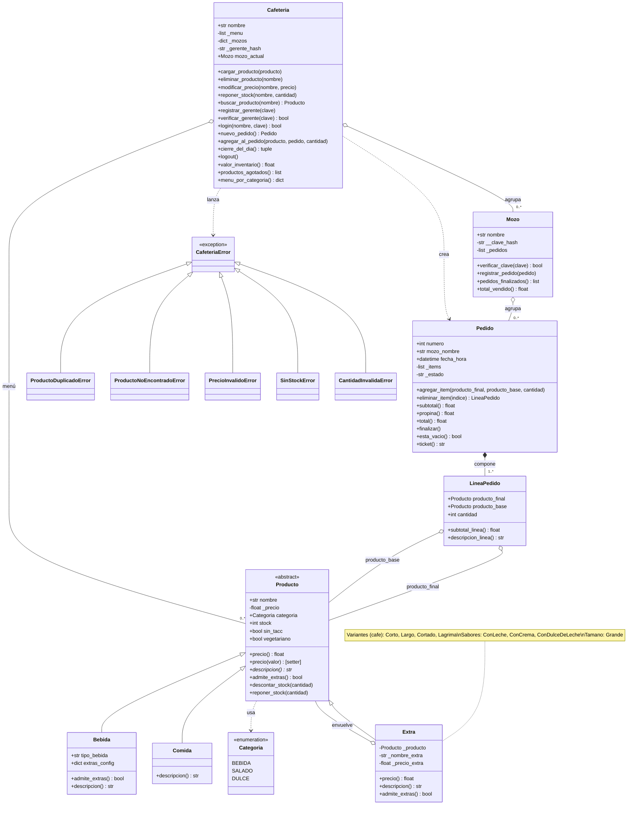

# Simulador de Pedidos de Cafetería

Trabajo Práctico Integrador (TPI) — Programación Avanzada 2026

Aplicación de consola que simula la gestión de pedidos de una cafetería durante
una jornada de trabajo. El **mozo** registra lo que pide cada cliente, calcula
el total con propina y emite el ticket. El **gerente** administra el menú, el
stock y consulta el cierre del día.

> El cliente no es usuario del sistema: pide de palabra y el mozo opera el
> programa. Por eso los actores son **Mozo** y **Gerente**.

---

## Objetivo

Demostrar la aplicación de los conceptos de Programación Orientada a Objetos,
Diseño Orientado a Objetos y patrones de diseño, priorizando la claridad del
diseño por sobre la cantidad de funcionalidades.

---

## Funcionalidades

### Mozo
- Inicio de sesión con nombre + clave (hasheada con SHA-256).
- Menú organizado por categorías (Bebidas, Salado, Dulce), con precio, stock e
  indicadores *sin TACC* / *vegetariano*.
- Al elegir un producto se ingresa la **cantidad** (ej: 3 medialunas de una vez).
- Personalización de bebidas mediante el **patrón Decorator**:
  - **Variantes de preparación** (solo para café): Corto, Largo, Cortado, Lágrima
    — se elige **una sola** y luego se ofrecen los sabores correspondientes.
  - **Sabores combinables**: dependen de la variante elegida (ver tabla abajo).
  - **Tamaño grande**: pregunta separada (s/n), solo para tipos que lo admiten.
- Posibilidad de **quitar ítems** del pedido antes de finalizar (repone stock).
- **Propina automática del 10%** sobre el subtotal.
- Ticket con fecha/hora, detalle de ítems y totales.
- Control de **stock**: se descuenta al agregar al pedido y no permite vender
  productos agotados (`@verificar_stock`).

#### Extras por variante de café

| Variante     | Leche | Crema | Dulce de leche | Grande |
|---|:---:|:---:|:---:|:---:|
| Sin variante | —     | —     | —              | —      |
| Corto        | ✓     | ✓     | ✓              | —      |
| Largo        | ✓     | ✓     | ✓              | —      |
| Cortado      | —     | ✓     | ✓              | ✓      |
| Lágrima      | —     | ✓     | ✓              | ✓      |

> Cortado y Lágrima no ofrecen leche (ya la llevan implícita en su preparación).
> Corto y Largo no admiten Grande (el nombre ya define el tamaño).

#### Extras para otras bebidas

| Bebida       | Sabores disponibles       | Grande |
|---|---|:---:|
| Capuchino    | Crema, Dulce de leche     | ✓      |
| Submarino    | Crema, Dulce de leche     | ✓      |
| Té / Mate    | Leche                     | ✓      |
| Jugo         | —                         | ✓      |

### Gerente
- Autenticación propia con clave hasheada (SHA-256), independiente de los mozos.
- **Administrar menú:**
  - Ver inventario con valor total.
  - Modificar precio de un producto eligiendo por número desde el menú.
  - Reponer stock eligiendo el producto **por número** desde el menú.
  - Ver productos agotados.
  - **Cargar producto nuevo**: elige categoría (bebida/salado/dulce); si es
    bebida, responde si tiene variantes y qué sabores/grande admite. Para
    cualquier categoría se puede marcar **sin TACC** y/o **vegetariano**, y se
    define la cantidad inicial de stock — el sistema define el comportamiento
    automáticamente.
  - **Dar de baja** un producto eligiendo por número, con confirmación.
- **Cierre del día**: consolida ventas de todos los mozos.
- **Persistencia entre sesiones**: stock y precios se guardan en
  `estado_cafeteria.json` después de cada pedido y cada cambio del gerente.
  Al reiniciar el programa se restaura el estado anterior.

---

## Conceptos de POO aplicados

| Concepto | Dónde |
|---|---|
| **Abstracción** | `Producto` es clase abstracta (`ABC`) con método abstracto `descripcion()`. |
| **Herencia** | `Bebida` y `Comida` heredan de `Producto`. `Extra` también hereda de `Producto` (patrón Decorator). |
| **Polimorfismo** | Cada producto y cada `Extra` resuelve `precio` y `descripcion()` a su manera; `Pedido` los recorre sin conocer el tipo concreto. |
| **Encapsulamiento** | Claves de mozos y gerente guardadas hasheadas (SHA-256) en atributos privados. Precio expuesto con `@property` + setter; total y propina calculados por métodos, no accesibles directamente. |
| **Relación entre objetos** | Agregación: `Cafeteria` agrupa `Mozos` y el menú. Composición: `Pedido` se compone de `LineaPedido`. |

---

## Patrones y decoradores

Este proyecto usa **dos cosas distintas que comparten el nombre "decorador"**,
a propósito, para demostrar que se entiende la diferencia:

1. **Patrón de diseño Decorator (GoF)** — estructural, implementado con
   **clases** en `modelos/extra.py`. La clase `Extra` envuelve un `Producto` y
   le suma precio y descripción. Permite combinar extras (Café → Cortado →
   ConCrema) sin crear una clase por cada combinación posible.

2. **Decoradores de función de Python** (la sintaxis `@`) — en
   `decoradores/validaciones.py`. `@verificar_stock` frena la acción si no hay
   stock suficiente; `@requiere_login` controla que haya sesión iniciada. Son
   una herramienta del lenguaje, **no** el patrón de diseño GoF.

---

## Estructura del proyecto

```
simulador-cafeteria/
├── main.py                  # Interfaz de consola (orquesta, sin lógica de negocio)
├── estado_cafeteria.json    # Estado persistido (creado automáticamente)
├── modelos/
│   ├── producto.py          # Producto (abstracta), Bebida (con tipo_bebida y extras_config), Comida
│   ├── extra.py             # Patrón Decorator: Extra y subclases; catálogos por tipo/variante
│   ├── pedido.py            # LineaPedido, Pedido (items, subtotal, propina, ticket con timestamp)
│   ├── mozo.py              # Mozo: login, pedidos propios
│   ├── excepciones.py       # Jerarquía de excepciones del dominio
│   └── cafeteria.py         # Cafeteria: menú, stock, mozos, autenticación gerente, cierre
├── decoradores/
│   └── validaciones.py      # @verificar_stock (con cantidad), @requiere_login
└── utils/
    ├── categorias.py        # Enum Categoria (BEBIDA, SALADO, DULCE)
    ├── datos_iniciales.py   # Menú y mozos iniciales, registro del gerente
    └── persistencia.py      # guardar_menu / cargar_menu (JSON)
```

---

## Diagrama de clases (UML)



---

## Cómo ejecutar

Requiere Python 3.10 o superior. No usa librerías externas.

```bash
python main.py
```

### Datos de prueba ya cargados

- **Mozos:** Carlos, María, José — **clave:** `1234`
- **Gerente:** **clave:** `gerente1234`
- **Menú inicial:** 14 productos en Bebidas, Salado y Dulce.

### Flujo sugerido para la demostración

1. **Menú principal → Mozo** → Carlos / `1234`
2. **Tomar pedido** → elegir Café → variante Cortado → agregar Crema → responder "s" a Grande → finalizar → ver ticket con timestamp y propina.
3. **Volver al menú → Gerente** → `gerente1234` → Administrar menú → Modificar precio o Reponer stock, eligiendo el producto por número.
4. **Gerente → Cargar producto nuevo** → Bebida → sin variantes → admite crema y dulce de leche → admite grande → sin TACC: n → vegetariano: n → stock inicial → (ej: Café helado).
5. **Gerente → Cierre del día** → ver ventas consolidadas por mozo.
6. **Salir y volver a entrar** → verificar que el stock y precios persisten.

---

## Integrantes

| Nombre | DNI |
|---|---|
| Aldana Benavent | 34.175.035 |
| Emiliano Maydana | 46.108.946 |
| Luciano Gabriel Zenobio | 44.598.717 |
| Miguel Di Dio | 44.710.442 |

## Materia

Programación Avanzada — 2026
